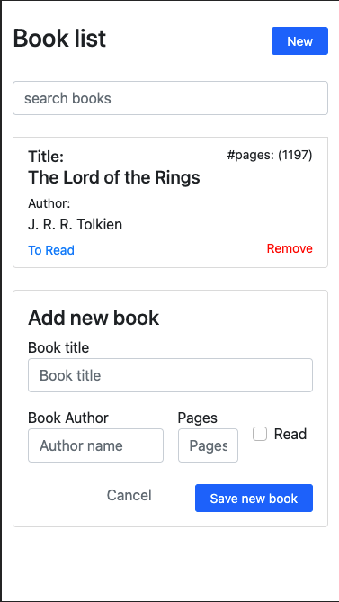

# Book library build with Java Script

> This is the first collaborative project in the Javascript module. It is the implementation of "Objects" and the "Object Constructor."

Additional description of the project and its features.

## Built With

- Java Script
- HTML, CSS 

## Live Demo

[Live Demo Link](https://marijanbrvar.github.io/Library/)

## Getting Started

1. By clicking on the above link, 'Live demo,' you can check our Book Library application live.
2. There is a sample book already.
3. To add a new book, click on the button in the upper right corner marked 'New.'
4. You will notice a new form appear below the book list.
5. Enter information about the new book and click on the Save button.
6. Notice. Books are not stored in any database, and this demo is solely for learning!

### Setup

1. Clon our repository to your computer by executing the command `git clone git@github.com:marijanbrvar/Library.git && cd Library`

2. Open code in your favorite code editor and run with a live server how it supposes to look like. You can check on the link above.

3. Feel free to adapt, improve or change everything.

## Authors

👤 MARIJAN BRVAR

- GitHub: [@githubhandle](https://github.com/marijanbrvar)
- Twitter: [@twitterhandle](https://twitter.com/marijanbrvar)
- LinkedIn: [LinkedIn](https://linkedin.com/in/marijanbrvar)

👤 DONAT UWAMAHORO

- Github: [@githubhandle)](https://github.com/uwadonat)
- Linkedin: [@twitterhandle)](https://www.linkedin.com/in/uwadonat)
- Twitter: [LinkedIn)](https://twitter.com/uwahoroDonat)

## 🤝 Contributing

Contributions, issues, and feature requests are welcome!

Feel free to check the [issues page](https://github.com/marijanbrvar/Library/issues).

## Show your support

Give a ⭐️ if you like this project!

## Acknowledgments

 Odin book library project at Java Script Module

## 📝 License

- This project is [MIT](https://github.com/marijanbrvar/Library/blob/development/LICENSE) licensed.
- This project is [creativecommons](https://creativecommons.org/licenses/by-nc/4.0/) licensed.